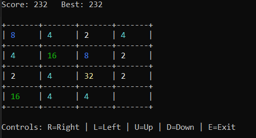
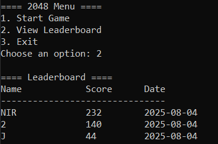

# 2048 Game – Enhanced Version
An enhanced version of the classic **2048 game** written in **C**, now with a polished interface and new features.  
This version is designed to be **clean, user-friendly, and visually clear**, making it stand out as a solid console project.

## Features 
- **Color-coded board** with clear redraw on every move.  
- **Main menu**: Start Game, View Leaderboard, Exit.  
- **Leaderboard**: Saves top 10 scores with **player name** and **date**.  
- **In-game controls hint** for a smoother experience.  
- **Improved screen handling** – the board refreshes in place instead of scrolling.  

## Controls
- **R** – Move Right  
- **L** – Move Left  
- **U** – Move Up  
- **D** – Move Down  
- **E** – Exit  

## Leaderboard
Track the **top 10 scores** with player names and dates:  

## How to Build
### Windows (Visual Studio)
1. Open the solution `2048-Game.sln` in **Visual Studio**.  
2. Build and run the project (default configuration: Debug/x64).  

### Linux/Mac (Makefile)
make
./game

## Project Structure
include/           # Header files
src/               # Source files
2048-Game.sln      # Visual Studio solution
leaderboard.txt    # Stores top scores
highscore.txt      # Stores highest score

## Future Improvements
- Highlighting when achieving a **New High Score**.  
- Preventing duplicate leaderboard entries for the same player/score.  
- Optional **export of leaderboard** to CSV for analysis.  

## License
This project is licensed under the [MIT License](LICENSE).
