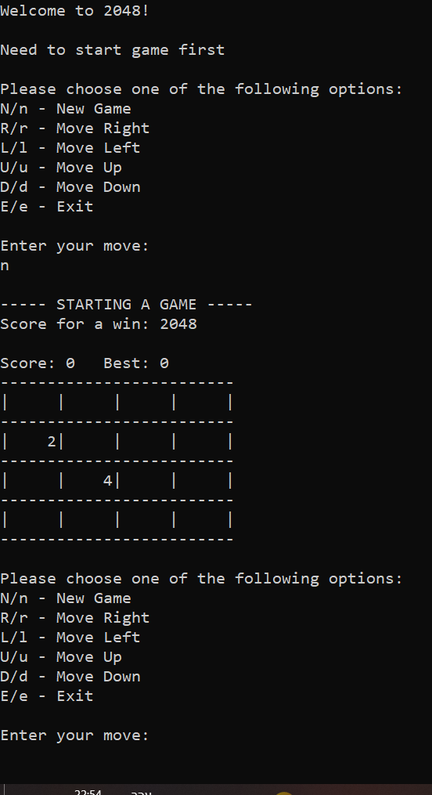

# 2048 Game – C Project



This project is an implementation of the classic **2048 game** written in **C**, developed as part of my coursework at **Afeka College (2024)**.  
The project is organized with a clean structure and includes support for **Visual Studio** for easy building and debugging.

## Features
- Full implementation of the **2048 game logic** in C.  
- Clear **modular structure** – separate header and source files (`.h` / `.c`).  
- **Configurable board size** and **winning score**.  
- **Per-user High Score system** – each player has their own high score file, named with their username and timestamp.  
- **Player identification in menu** – the game displays the current player's name alongside their best score.  
- Designed to run on **Windows** using Visual Studio, with **cross-platform support** via Makefile.  

## Project Structure
```
.
├── include/                      # Header files
├── src/                          # Source files
├── 2048-Game.sln                 # Visual Studio solution file
├── 2048-Game.vcxproj             # Visual Studio project file
├── 2048-Game.vcxproj.filters     # Visual Studio filters for organizing code
├── Makefile                      # Build script for Linux/Unix (make & ./game)
├── LICENSE                       # MIT license – allows use and modification
├── .gitignore                    # Files ignored by Git
├── .gitattributes                # Git configuration (e.g., line endings)
└── README.md                     # Project description
```

## How to Run

### Option 1: Visual Studio (Windows)
1. Clone this repository:
   ```bash
   git clone https://github.com/Rotem-Shimon/2048-Game.git
   ```
2. Open `2048-Game.sln` in **Visual Studio**.  
3. Build and run the project (press **F5**).  
4. When prompted, enter your **username** – the game will create a personalized high score file for you.

### Option 2: Compile with Makefile (Linux/Unix)
For non-Windows environments or when Visual Studio is not available:
```bash
make
./game
```
The included **Makefile** simplifies building and running the game on Unix-based systems.

## Future Improvements
- Adding **graphical interface** (currently console-based).  
- Saving and loading **game progress** between sessions.  

## License
This project is released under the **MIT License** – feel free to use, modify, and share it.  
See the [LICENSE](./LICENSE) file for details.
